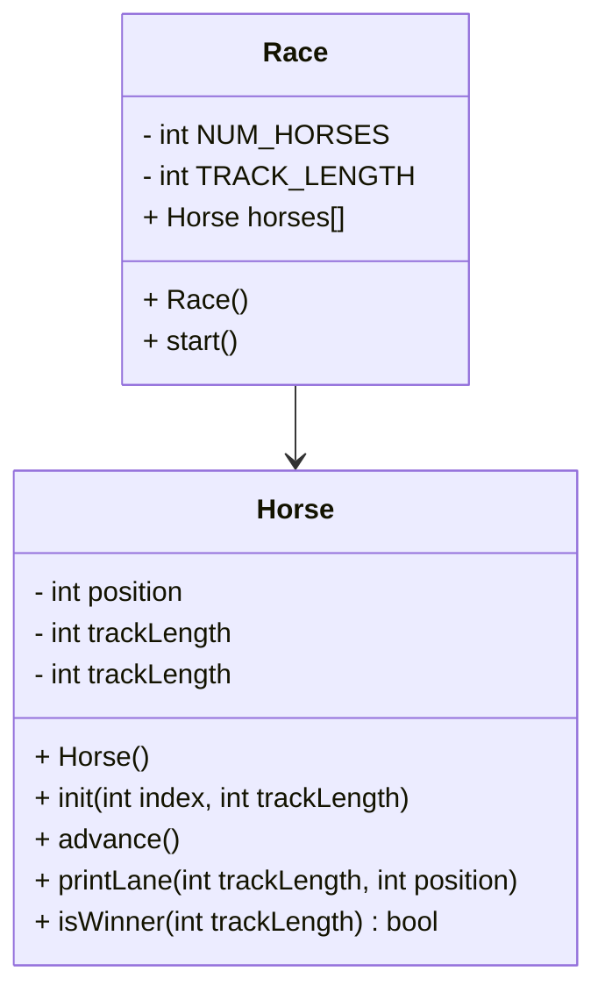

# CS121-Project-4-Horse-Game-Java

```mermaid
classDiagram

class Horse {
    - int position
    - int trackLength
    - int trackLength
    + Horse()
    + init(int index, int trackLength)
    + advance()
    + printLane(int trackLength, int position)
    + isWinner(int trackLength) bool

}

class Race {
    - int NUM_HORSES
    - int TRACK_LENGTH
    + Horse horses[]
    + Race()
    + start()
}

Race --> Horse
```
